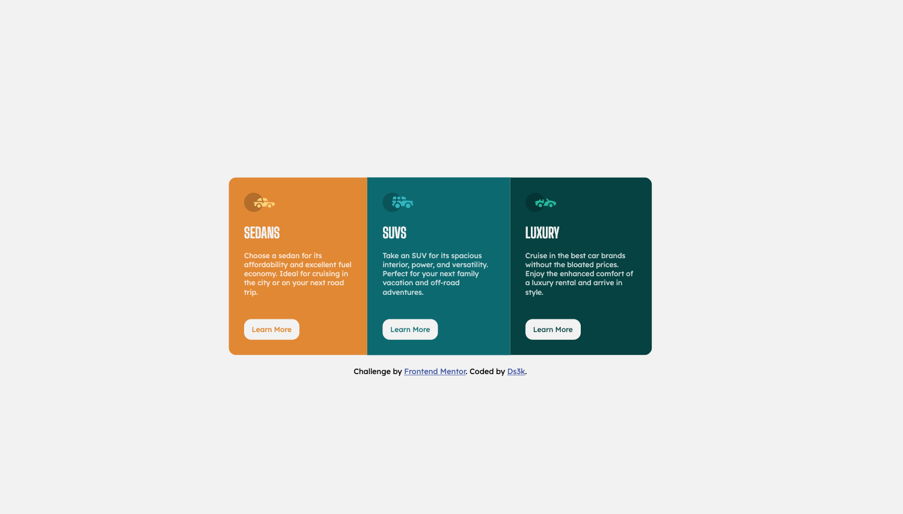
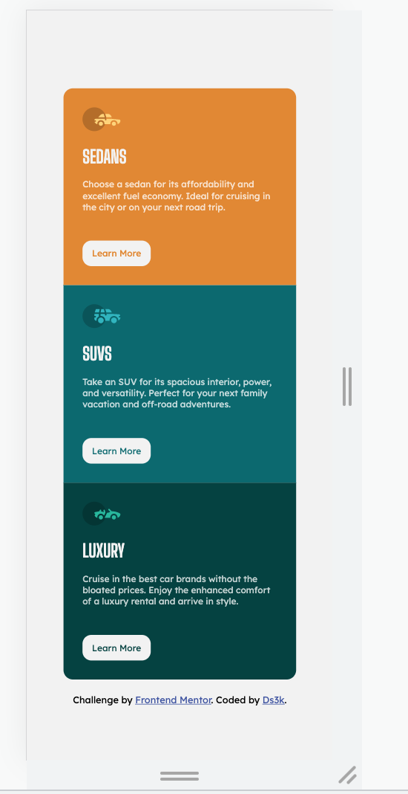

## Table of contents

- [Overview](#overview)
  - [The challenge](#the-challenge)
  - [Screenshot](#screenshot)
  - [Links](#links)
- [My process](#my-process)
  - [Built with](#built-with)
  - [What I learned](#what-i-learned)
  - [Continued development](#continued-development)
  - [Useful resources](#useful-resources)
- [Author](#author)

## Overview
This is a solution to the [3-column preview card component challenge on Frontend Mentor](https://www.frontendmentor.io/challenges/3column-preview-card-component-pH92eAR2-). Frontend Mentor challenges help you improve your coding skills by building realistic projects. 

### The Challenge
Users should be able to:

- View the optimal layout depending on their device's screen size
- See hover states for interactive elements

### Screenshot
Desktop View

Mobile View

### Links
- Solution URL:
- Live Site URL:

## My process
From the onset, I decided on using CSS and some HTML5 to practice on my the basis of styling using CSS Grid but ending up using CSS FLexbox.

### Built with
- Semantic HTML5 markup
- CSS custom properties
- Flexbox

### What I learned
I learnt a ton about CSS Grid and Flexbox using mainly w3schools.com and MDN. I also learnt how to work with Google Font and using CSS variables.

## Author
- Frontend Mentor - @Ds3k (https://www.frontendmentor.io/profile/Ds3k)

